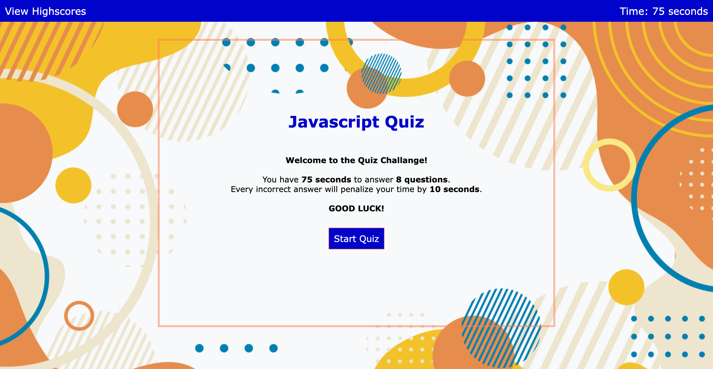

# JavaScript-Quiz

## Description
The JavaScript Code Quiz has 8 multiple-choice questions. The user has a certain amount of time to complete the quiz. Upon completion, the user will see their score and can add it to the Leaderboard.

It was a fun and challenging project. I was able to use my creativity to create a fun quiz. The challenging part was creating the code for specific elements I wanted the quiz to have. Overall, I learned from my errors, and feel thankful for the help I got from our teacher. 

## Feature
* Timer
* Shuffle Questions
* Highlight the Correct Answer
* Input Initials
* View Highscore in the Leaderboard

## Website Preview

## Link Deploy Application

[Deploy Application](https://jjimenez174.github.io/Code-Quiz)

## Reference
https://www.w3schools.com/js/js_quiz.asp